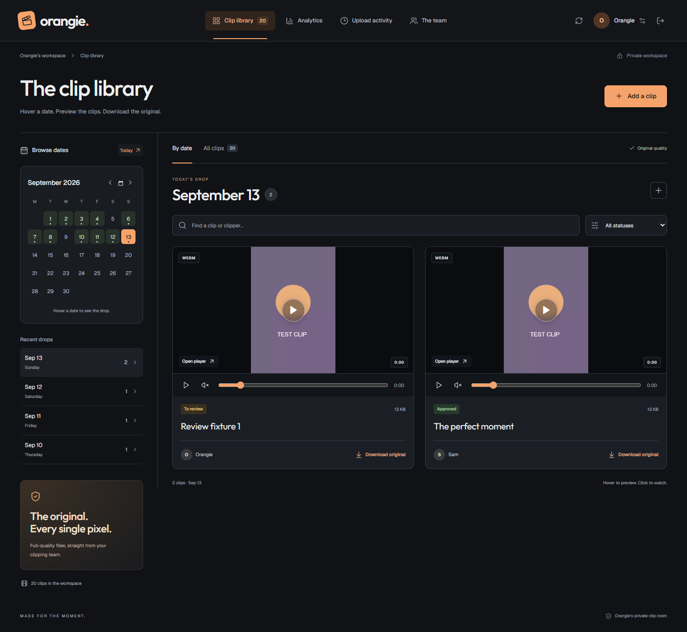

# Orangie's clip room

[Open the workspace](https://orangieclips.vercel.app) ? [Source](https://github.com/Aymaneerrachidi/orangieclips)



A dark media workspace with top navigation, a compact date rail, large original-quality clip previews, and role-based access. A full calendar opens on today: hover a date to preview its clips, hover a clip to play it inline, click to open the full player, or download the original directly from the date panel. On mobile, tapping a date brings its clips into view.

## Start

Requires Node.js 22.17 or newer.

```sh
npm install
npm run build
npm start
```

Open http://127.0.0.1:3001. Development: `npm run dev`, then http://localhost:5173.

### Automatic workspace and owner

On a fresh database, startup creates **Orangie's workspace**, **Orangie's Owner account**, and the Owner / Team / Clipper Manager / Clipper permission definitions. There is no public workspace setup form and no shared default password.

- Set `OWNER_EMAIL` and `OWNER_PASSWORD` before first startup to supply initial owner credentials. Passwords must contain 12-200 characters.
- If no password is supplied, startup generates a random password and writes it to `data/owner-access.txt` (or your `DATA_DIR`). The default initial email is `orangie@cliproom.local`. This file is excluded from Git and is never served by the app.
- Change the initial password through **Your account** after signing in. The initial credentials file is not updated by later password changes.
- On an existing installation, the existing owner, accounts, sessions, and clips are preserved. Bootstrap environment variables do not overwrite existing credentials. Existing clips begin with **To review** status.
- Orangie adds real people through **The team → Add member**, choosing Team, Clipper Manager, or Clipper. No fake members or shared team accounts are created.

## Role permissions

| Capability | Owner (Orangie) | Team | Clipper |
| --- | --- | --- | --- |
| Upload clips | Yes | Yes | Yes |
| Preview / download clips | All | All | Own only |
| Calendar counts and library totals | Workspace | Workspace | Own only |
| Daily stats and CSV exports | Workspace + contributors | Workspace + contributors | Own only |
| Review clips and leave feedback | Yes | Yes | Read own feedback |
| See member directory | Yes, including emails | Yes, including emails | No |
| Add members, change roles, disable access | Yes | Yes | No |
| Reset another member's password | Yes | Yes | No |
| Change own password | Yes | Yes | Yes |
| Activity history | Uploads, reviews, account audit | Uploads, reviews, account audit | Own clip activity |

Permissions are checked server-side on metadata, statistics, activity, and the original-file routes. A clipper cannot access another clipper's file by copying its URL. The single owner cannot be demoted or disabled through account management. Role/access changes, disabling accounts, and password resets revoke that member's sessions. Password changes revoke other sessions and issue a fresh session to the current browser. Sessions last seven days.

Clipper Managers can add clippers, edit their names and emails, reset passwords, enable or disable sign-in, and delete clipper accounts. Their directory contains only clippers. They cannot create staff, promote accounts, or manage Orangie, Team, or other managers. Their clip library, statistics, and activity remain personal, like a clipper's. Orangie and Team assign staff roles. Team has the same permissions as Owner; the original Owner account remains protected for everyone.

Deleting a clipper removes the account from the directory and revokes sign-in and sessions. Uploaded clips and contribution history remain available to Owner and Team. The deleted email remains reserved for audit continuity.

## Analytics and review workflow

- **7 / 30 / 90 days or custom range** (up to 366 days).
- **Daily delivery chart:** includes zero-upload dates; click a bar to inspect that day's clips and open the date in the library.
- **Period totals:** clips delivered, original bytes, active contributors, active assigned dates, daily average, approved/posted clips, and comparison with the previous equal-length period.
- **All-time totals:** scoped to the workspace for Owner/Team and to the current user for Clippers.
- **Contributor breakdown:** uploads, active dates, approved/posted totals, original bytes, and share of period uploads. Includes members with no uploads and preserves disabled members' contribution history.
- **CSV exports:** daily statistics for every role's permitted scope; contributor export for Owner/Team. CSV fields are escaped and protected against formula injection.
- **Posting tags:** Orangie and Team can choose **Ima post** or **Post on Orangie clip page** in the clip player. Tags appear on cards and can be filtered in the library. They record intent only.
- **Not posting:** requires a reason and clears the posting tag. Orangie and Team can edit the shared note, and the owning clipper can read it. Status, tag, and note changes appear in clip activity.
- **Statuses:** To review, Approved, Changes needed, Posted, Not posting. Owner/Team can update statuses and add notes in the clip preview. Requesting changes requires a note. Clippers can see feedback on their own clips.
- Stats are grouped by the **assigned calendar date**, not the actual upload timestamp. Activity retains the real timestamp. Approval/posted counts describe **current status**, not historical status at the end of a period. Posting is a manual status; it does not publish to social media.
- No social views, playback events, or download counters are tracked.

## Uploads and persistence

MP4, MOV, M4V, and WebM are accepted, up to 2 GB per clip. Uploaded bytes and the original filename are preserved. Browser codec support varies, particularly for MOV/HEVC: unsupported previews can still be downloaded unchanged. This version does not generate compatible preview transcodes.

The app refreshes on window focus and every minute. Use the refresh button for an immediate update. Inline controls provide play/pause, mute, and seeking on desktop and touch devices. Hover playback is muted and pauses when leaving the card; reduced-motion preferences disable automatic playback. Use By date for calendar browsing or All clips for the complete permitted archive. Search and review-status filters apply to the active view. The split-screen review dialog keeps the video, original download, and feedback side by side on desktop.

Accounts, sessions, metadata, workspace records, and audit events persist in `data/clips.sqlite`; original files are in `data/uploads/`. Back up the database and uploads together. Schema migration is additive and restart-safe. Local mode needs no external storage. Cloud mode uses Neon Postgres and a private Backblaze B2 or Cloudflare R2 bucket. No email service is connected.

## Vercel + Neon + Backblaze B2

The frontend and API are deployed at https://orangieclips.vercel.app. Account data persists in Neon Postgres. Original videos are stored in a private Backblaze B2 bucket. Deployments without storage credentials show an explicit storage-unavailable message when an upload is attempted. The repository contains no accounts, passwords, database backups, or original clips.

### Backblaze B2 (no-card storage option)

The app supports a private Backblaze B2 bucket through its S3-compatible API. Create a bucket-scoped Read and Write application key, then set these server-only Vercel variables: `B2_ENDPOINT`, `B2_REGION`, `B2_BUCKET`, `B2_KEY_ID`, and `B2_APPLICATION_KEY`. B2 configuration takes priority over R2 when `B2_ENDPOINT` is present. No credentials belong in the frontend or repository.

For the configured bucket, the endpoint is `https://s3.us-east-005.backblazeb2.com` and the region is `us-east-005`. Keep the bucket private. Configure CORS for the production origin and S3 GET, HEAD, and PUT operations. [Backblaze CORS documentation](https://www.backblaze.com/docs/cloud-storage-cross-origin-resource-sharing-rules).

Migration uses the same script:

```sh
node --env-file=.env.cloud --env-file=.env.b2 server/migrate-cloud.js
```

### Alternative: Cloudflare R2 configuration

Connect a Neon Postgres database to the Vercel project and set these server-only environment variables:

| Variable | Purpose |
| --- | --- |
| `DATABASE_URL` | Postgres connection string; required on Vercel |
| `R2_ENDPOINT` | `https://ACCOUNT_ID.r2.cloudflarestorage.com` |
| `R2_BUCKET` | Private bucket name |
| `R2_ACCESS_KEY_ID` | Bucket-scoped S3 access key |
| `R2_SECRET_ACCESS_KEY` | Bucket-scoped S3 secret |
| `OWNER_EMAIL`, `OWNER_PASSWORD` | Initial owner on a fresh cloud database only; use your own password |

Use an R2 token with **Object Read & Write** permission restricted to this bucket. Keep public bucket access disabled. In the bucket's **Settings > CORS policy**, paste [r2-cors.json](r2-cors.json); replace the production origin if you use another domain. R2 includes a limited free allowance, not unlimited free storage: [pricing](https://developers.cloudflare.com/r2/pricing/).

```sh
npm install
npm run build
vercel --prod
```

Vercel automatically enables Secure session cookies. It never writes accounts or videos to the deployment filesystem. Login throttling is stored in the database so it also applies across function instances.

### How originals travel

The server authorizes an upload and issues one-hour, object-scoped URLs for 16 MB parts. The browser uploads directly to private object storage, three parts at a time, with progress and retries. Completion verifies the actual part sizes and original size before adding one clip and one activity event. Repeated completion requests do not double-count clips. Canceled uploads are aborted; configure an incomplete-multipart lifecycle rule in the storage provider to clean up abandoned browser sessions.

Every preview/download request checks the signed-in user's role and clip ownership before issuing a 15-minute read URL for that object. Video byte ranges and downloads go directly to private object storage. Signed read links remain usable until expiry, including after a session is revoked. Filenames and original bytes are preserved; no transcoding or social-view tracking is performed.

### Migrating existing local data

Keep database and storage credentials in ignored local environment files, then run:

```sh
node --env-file=.env.cloud --env-file=.env.r2 server/migrate-cloud.js
```

The migration backs up SQLite first, copies accounts and the workspace, uploads originals to the private bucket, verifies file sizes, and copies clip metadata and associated activity. It is repeatable by record ID and never overwrites existing cloud accounts. Password hashes are preserved; sessions are not copied. Running with only `.env.cloud` migrates accounts, leaving originals local until object storage is connected.

### Local server options

Without `DATABASE_URL`, the app continues to use SQLite and local original files.

| Variable | Default / use |
| --- | --- |
| `HOST` | `127.0.0.1` |
| `PORT` | `3001` |
| `DATA_DIR` | Project `data/` directory; use a persistent disk |
| `COOKIE_SECURE` | Set to `true` behind HTTPS |
| `OWNER_EMAIL`, `OWNER_PASSWORD` | Initial owner on a fresh database only |

Authentication uses scrypt password hashes, opaque server-side sessions, HttpOnly/SameSite cookies, same-origin write checks, and login throttling. Orangie can reset member passwords; each user can change their password in Account. There is no self-service email recovery.

## Verification

```sh
npm test
npm run test:ui
```

API tests cover automatic provisioning, existing-data migration, duplicate-free activity migration, permissions, direct-file isolation, login/logout, session revocation, review rules, analytics date math, original-byte downloads, and byte-range playback.

Browser tests use locally installed Chrome (`BROWSER_CHANNEL` can override), disposable databases/accounts, and a generated test video. They cover all three roles, uploads, date hovering, playback, downloads, review feedback, role management, daily statistics, CSV export, accessibility, and mobile overflow. Screenshots in `artifacts/` contain test fixtures, not production data. Tests never modify the workspace database.

Cloud upload tests use a simulated object store to verify ownership, size validation, and duplicate-free completion. Real object-storage transfers require configured credentials and CORS.
